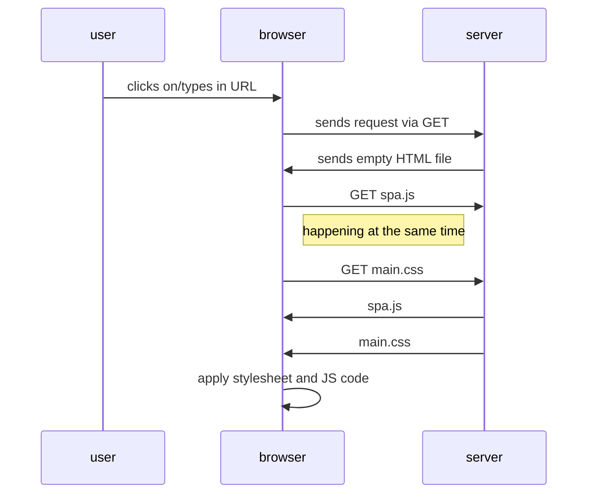

```mermaid
sequenceDiagram
    participant user
    participant browser
    participant server

    %%user goes to url
    user->>browser: clicks on/types in URL

    %%get request sent to server
    browser->>server: sends request via GET
    server->>browser: sends empty HTML file
    browser->>server: GET spa.js
    Note right of browser: happening at the same time
    browser->>server: GET main.css
    server->>browser: spa.js
    server->>browser: main.css

    %%apply files
    browser->>browser: apply stylesheet and JS code


```