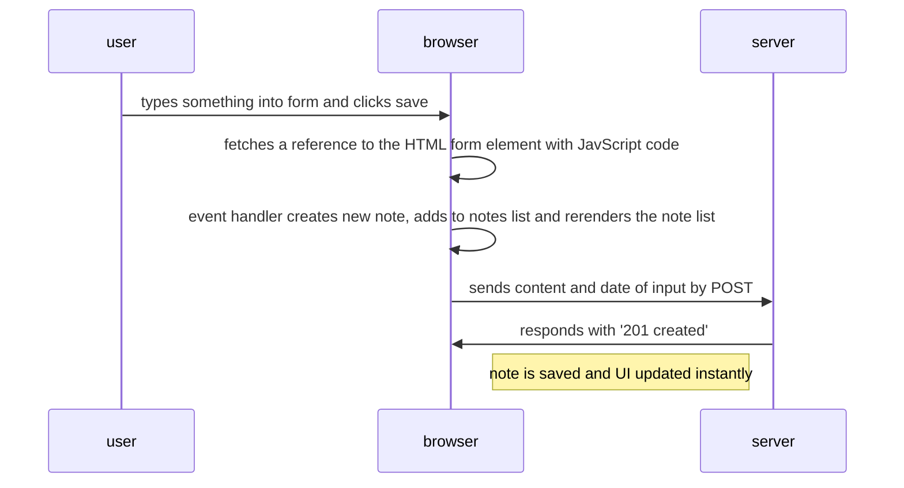

```mermaid
sequenceDiagram
    participant user
    participant browser
    participant server


    %%user types something into form and clicks save
    user->>browser: types something into form and clicks save
    

    %%browser fetches a reference to the HTML form element with JavScript code
    browser->>browser: fetches a reference to the HTML form element with JavScript code

    %%event handler creates new note, adds to notes list and rerenders the note list
    browser->>browser: event handler creates new note, adds to notes list and rerenders the note list

    %%%browser sends content and date of input to server by POST
    browser->>server: sends content and date of input by POST

    %%server responds with '201 created' 
    server->>browser: responds with '201 created' 
    Note left of server: note is saved and UI updated instantly


```